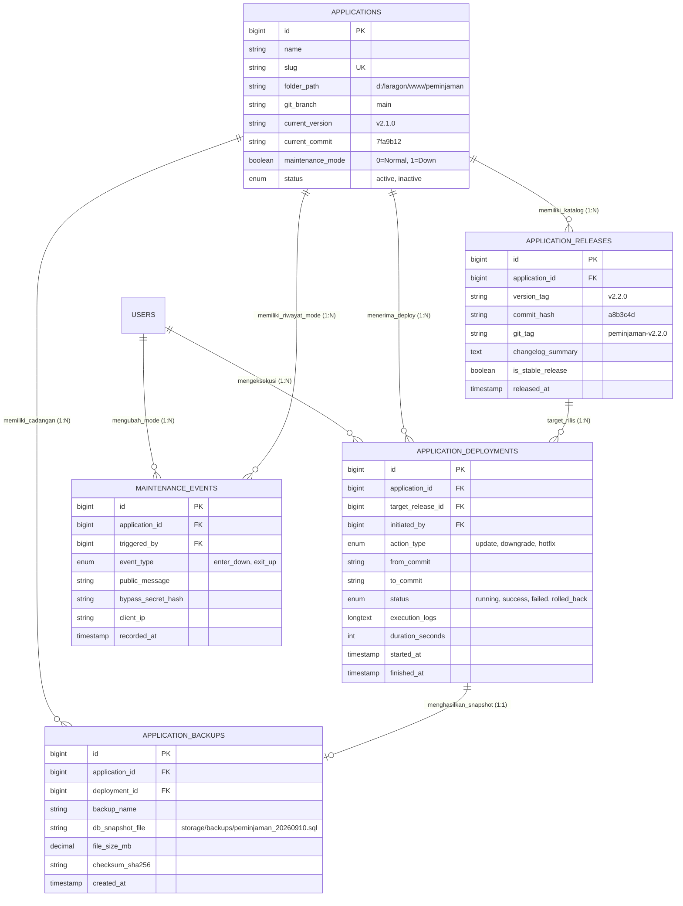
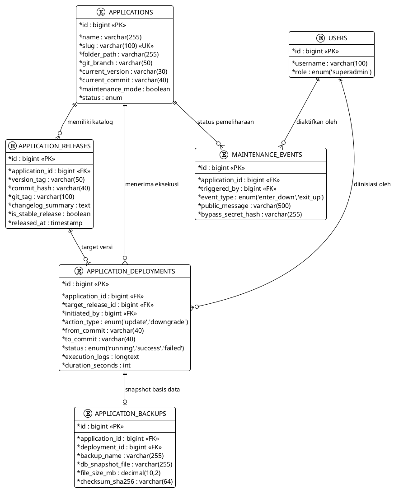
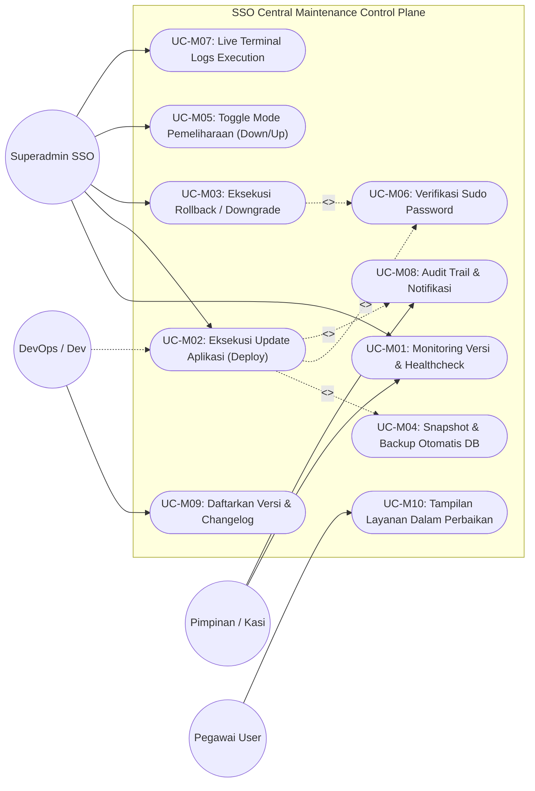
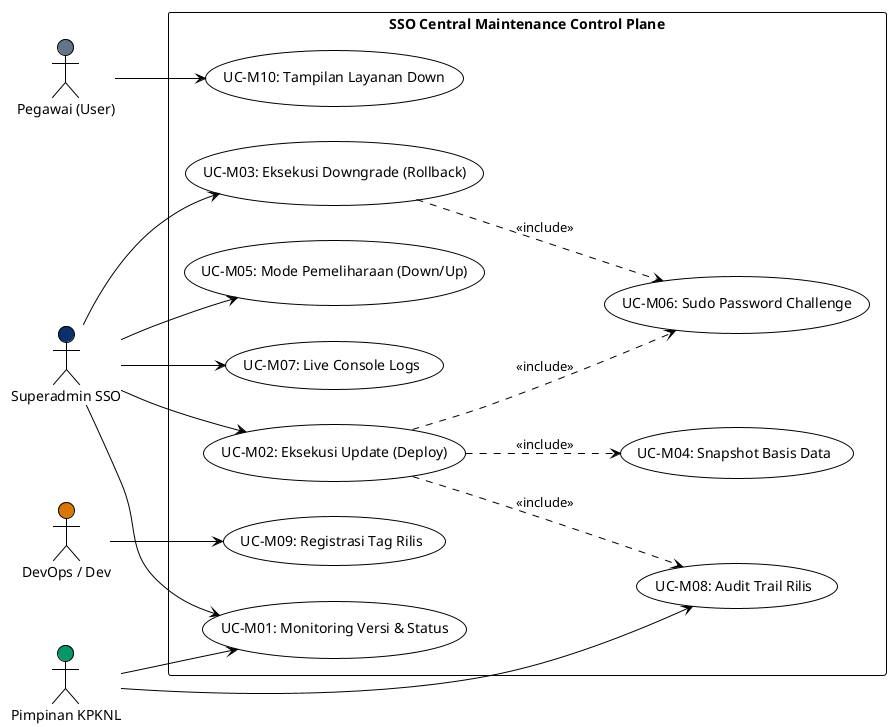
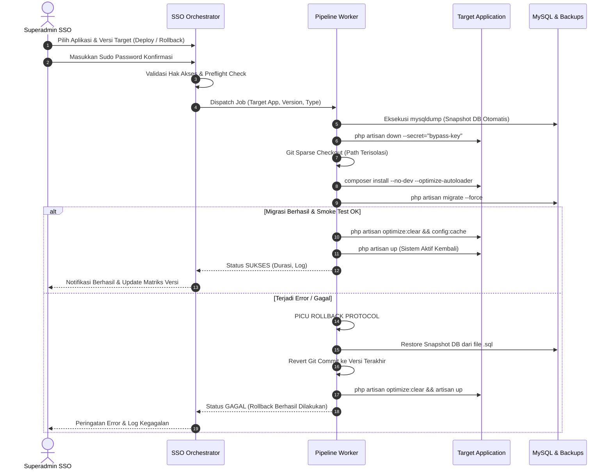
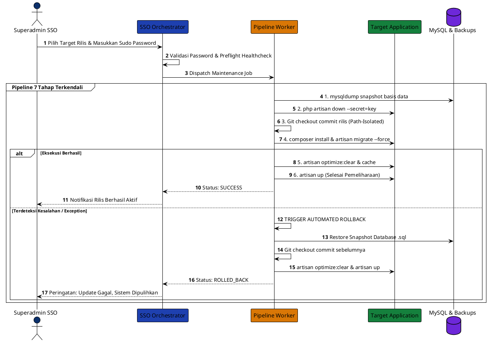

# DOKUMENTASI ARSITEKTUR, AKTOR, RACI & DIAGRAM SISTEM
## MODUL CENTRAL APPLICATION MAINTENANCE & LIFECYCLE ORCHESTRATOR
**Portal Single Sign-On (SSO) &bull; KPKNL Palembang &bull; Kementerian Keuangan RI**

---

### DAFTAR ISI
1. [Latar Belakang & Ruang Lingkup Sistem](#1-latar-belakang--ruang-lingkup-sistem)
2. [Analisis Aktor & Matriks RACI](#2-analisis-aktor--matriks-raci)
3. [Entity Relationship Diagram (ERD) & Skema Data](#3-entity-relationship-diagram-erd--skema-data)
   - [Deskripsi Tabel Baru SSO](#31-deskripsi-tabel-baru-sso)
   - [Diagram Visual SVG](#32-diagram-visual-svg)
   - [Spesifikasi Mermaid](#33-spesifikasi-mermaid)
   - [Spesifikasi PlantUML](#34-spesifikasi-plantuml)
   - [Spesifikasi Draw.io XML Importable](#35-spesifikasi-drawio-xml)
4. [Use Case Diagram & Spesifikasi Fungsional](#4-use-case-diagram--spesifikasi-fungsional)
   - [Katalog 10 Use Cases Pemeliharaan](#41-katalog-10-use-cases-pemeliharaan)
   - [Diagram Visual SVG](#42-diagram-visual-svg)
   - [Spesifikasi Mermaid](#43-spesifikasi-mermaid)
   - [Spesifikasi PlantUML](#44-spesifikasi-plantuml)
   - [Spesifikasi Draw.io XML Importable](#45-spesifikasi-drawio-xml)
5. [Business Process Model and Notation (BPMN 2.0)](#5-business-process-model-and-notation-bpmn-20)
   - [Standar Alur 7 Tahapan Updating & Protokol Downgrade](#51-standar-alur-7-tahapan)
   - [Diagram Visual SVG](#52-diagram-visual-svg)
   - [Spesifikasi Mermaid](#53-spesifikasi-mermaid)
   - [Spesifikasi PlantUML](#54-spesifikasi-plantuml)
   - [Spesifikasi Draw.io XML Importable](#55-spesifikasi-drawio-xml)

---

### 1. LATAR BELAKANG & RUANG LINGKUP SISTEM

KPKNL Palembang mengoperasikan ekosistem multi-aplikasi terintegrasi Single Sign-On (SSO):
1. **Sistem Informasi Peminjaman Risalah Lelang** (`peminjaman`): Tata kelola 10.483 akta risalah lelang fisik.
2. **Manajemen Aset Eks BPPN** (`aset-bppn`): Penatausahaan aset properti eks Badan Penyehatan Perbankan Nasional.
3. **Dashboard Eksekutif Pengelolaan BMN** (`Dashboard Pengelolaan BMN`): Monitoring aset BMN terindikasi idle.
4. **Sistem Monitoring TODO-LIST & Pelaporan** (`monlap`): Pemantauan target kinerja dan tenggat laporan seksi.
5. **Portal SSO Sentral** (`sso-kpknl-palembang`): Sentral identitas, autentikasi OAuth2, dan otorisasi hak akses.

Selama ini, pembaruan kode (*updating*) dan pemulihan versi (*downgrading*) dilakukan secara manual via terminal pada masing-masing folder aplikasi. Hal ini memicu risiko tinggi kelalaian manusia (*human error*), kegagalan migrasi database, dan ketiadaan riwayat audit perubahan rilis.

Modul **Central Application Maintenance & Lifecycle Orchestrator (CAMLO)** dibangun di dalam portal SSO untuk menjadi **Pusat Komando Tunggal (*Single Control Plane*)** yang mengotomatisasi seluruh siklus pemeliharaan aplikasi secara aman, atomik, dan teraudit.

---

### 2. ANALISIS AKTOR & MATRIKS RACI

#### 2.1 Profil Aktor Sistem
| Aktor | Peran Utama | Tanggung Jawab Operasional |
| :--- | :--- | :--- |
| **Superadmin SSO** | Operator Sentral Pemeliharaan | Menginisiasi rilis baru, menyetujui downgrade darurat, menginput sudo password verifikasi, dan memantau status kesehatan seluruh aplikasi. |
| **DevOps / Release Engineer** | Pengembang & Pengemas Rilis | Membuat Git Tag versi baru, menulis changelog, memastikan script migrasi aman, dan mendefinisikan dependensi vendor. |
| **Pimpinan / Kepala Seksi HI** | Pemilik Proses Bisnis & Auditor | Menerima laporan pemeliharaan sistem, menyetujui jadwal downtime pemeliharaan berkala, dan mengaudit log perubahan. |
| **End User (Pegawai)** | Pengguna Layanan Aplikasi | Menerima informasi banner pemeliharaan saat aplikasi sedang dalam mode *down* dan kembali bekerja saat aplikasi *up*. |

#### 2.2 Matriks RACI
- **R (Responsible):** Pelaksana teknis aktivitas.
- **A (Accountable):** Penanggung jawab akhir dan pengambil keputusan.
- **C (Consulted):** Pihak yang dimintai masukan atau konfirmasi sebelum eksekusi.
- **I (Informed):** Pihak yang menerima notifikasi hasil aktivitas.

| No | Aktivitas Pemeliharaan & Rilis | Superadmin SSO | DevOps / Dev | Pimpinan KPKNL | End User Pegawai |
| :-: | :--- | :---: | :---: | :---: | :---: |
| 1 | Pendaftaran Versi & Git Tag Rilis Baru | C | **R / A** | I | - |
| 2 | Penentuan Jadwal & Jendela Waktu Pemeliharaan | **R** | C | **A** | I |
| 3 | Verifikasi Preflight & Izin Akses Direktori | **R / A** | C | - | - |
| 4 | Pembuatan Snapshot Basis Data & File Backup | **R / A** | - | - | - |
| 5 | Aktivasi Mode Pemeliharaan (`artisan down`) | **R / A** | I | I | I |
| 6 | Penarikan Kode Rilis Terisolasi (*Path-Isolated Pull*) | **R / A** | C | - | - |
| 7 | Eksekusi Migrasi Basis Data (`migrate --force`) | **R / A** | C | - | - |
| 8 | Pembersihan & Pemanasan Cache Laravel (*Warm Cache*) | **R / A** | - | - | - |
| 9 | Pengujian Asap Pasca-Deploy (*Smoke Healthcheck*) | **R** | **A** | I | - |
| 10 | Penonaktifan Mode Pemeliharaan (`artisan up`) | **R / A** | I | I | I |
| 11 | Eksekusi Rollback Darurat (*Downgrading Protocol*) | **R / A** | C | I | I |
| 12 | Audit Trail & Evaluasi Pasca Pemeliharaan (*Post-Mortem*)| **R** | C | **A** | - |

---

### 3. ENTITY RELATIONSHIP DIAGRAM (ERD) & SKEMA DATA

#### 3.1 Deskripsi Tabel Baru SSO

```
+-----------------------------------------------------------------------------------+
|               TABEL BARU DI DALAM BASIS DATA sso_kpknl_palembang                  |
+-----------------------------------------------------------------------------------+
| 1. applications               : Diperluas dengan kolom folder_path, git_branch,   |
|                                 current_version, current_commit, maintenance_mode |
| 2. application_releases       : Riwayat katalog versi/tag, hash commit, changelog |
| 3. application_deployments    : Log eksekusi pipeline update/downgrade dan durasi |
| 4. application_backups        : Metadata snapshot database SQL sebelum pembaruan  |
| 5. maintenance_events         : Rekam jejak aktivasi mode down/up dan secret key  |
+-----------------------------------------------------------------------------------+
```

#### 3.2 Diagram Visual SVG
File diagram vektor tersimpan pada: [erd_maintenance_sso.svg](file:///d:/laragon/www/diagram_assets/erd_maintenance_sso.svg)


#### 3.3 Spesifikasi Mermaid


#### 3.4 Spesifikasi PlantUML


#### 3.5 Spesifikasi Draw.io XML Importable
```xml
<mxGraphModel dx="1200" dy="800" grid="1" gridSize="10" guides="1" tooltips="1" connect="1" arrows="1" fold="1" page="1" pageScale="1" pageWidth="1169" pageHeight="827">
  <root>
    <mxCell id="0"/>
    <mxCell id="1" parent="0"/>
    <mxCell id="t_app" value="APPLICATIONS&#xa;------------------------&#xa;+ id: bigint [PK]&#xa;+ name: varchar&#xa;+ slug: varchar [UK]&#xa;+ folder_path: varchar&#xa;+ current_version: varchar&#xa;+ maintenance_mode: bool" style="shape=table;startSize=30;container=1;collapsible=0;childLayout=tableLayout;fixedRows=1;rowLines=0;fontStyle=1;align=center;fillColor=#0c306b;strokeColor=#0c306b;fontColor=#ffffff;" vertex="1" parent="1">
      <mxGeometry x="60" y="80" width="220" height="150" as="geometry"/>
    </mxCell>
    <mxCell id="t_rel" value="APPLICATION_RELEASES&#xa;------------------------&#xa;+ id: bigint [PK]&#xa;+ application_id: bigint [FK]&#xa;+ version_tag: varchar&#xa;+ commit_hash: varchar&#xa;+ is_stable: bool" style="shape=table;startSize=30;container=1;collapsible=0;childLayout=tableLayout;fixedRows=1;rowLines=0;fontStyle=1;align=center;fillColor=#1e40af;strokeColor=#1e40af;fontColor=#ffffff;" vertex="1" parent="1">
      <mxGeometry x="360" y="80" width="230" height="150" as="geometry"/>
    </mxCell>
    <mxCell id="t_dep" value="APPLICATION_DEPLOYMENTS&#xa;------------------------&#xa;+ id: bigint [PK]&#xa;+ application_id: bigint [FK]&#xa;+ target_release_id: bigint [FK]&#xa;+ action_type: enum&#xa;+ status: enum&#xa;+ execution_logs: text" style="shape=table;startSize=30;container=1;collapsible=0;childLayout=tableLayout;fixedRows=1;rowLines=0;fontStyle=1;align=center;fillColor=#0c306b;strokeColor=#0c306b;fontColor=#ffffff;" vertex="1" parent="1">
      <mxGeometry x="670" y="80" width="250" height="160" as="geometry"/>
    </mxCell>
    <mxCell id="t_bkp" value="APPLICATION_BACKUPS&#xa;------------------------&#xa;+ id: bigint [PK]&#xa;+ deployment_id: bigint [FK]&#xa;+ db_snapshot_file: varchar&#xa;+ checksum_sha256: varchar" style="shape=table;startSize=30;container=1;collapsible=0;childLayout=tableLayout;fixedRows=1;rowLines=0;fontStyle=1;align=center;fillColor=#d97706;strokeColor=#d97706;fontColor=#ffffff;" vertex="1" parent="1">
      <mxGeometry x="670" y="320" width="250" height="130" as="geometry"/>
    </mxCell>
    <mxCell id="e1" edge="1" parent="1" source="t_app" target="t_rel"><mxGeometry relative="1" as="geometry"/></mxCell>
    <mxCell id="e2" edge="1" parent="1" source="t_rel" target="t_dep"><mxGeometry relative="1" as="geometry"/></mxCell>
    <mxCell id="e3" edge="1" parent="1" source="t_dep" target="t_bkp"><mxGeometry relative="1" as="geometry"/></mxCell>
  </root>
</mxGraphModel>
```

---

### 4. USE CASE DIAGRAM & SPESIFIKASI FUNGSIONAL

#### 4.1 Katalog 10 Use Cases Pemeliharaan
1. **UC-M01: Monitoring Matriks Multi-Aplikasi**: Menampilkan ringkasan status kesehatan, versi aktif, dan mode pemeliharaan dari 4 aplikasi.
2. **UC-M02: Eksekusi Update Aplikasi (Deploy Rilis)**: Menjalankan pipeline 7 tahap untuk memperbarui kode ke versi rilis yang lebih tinggi.
3. **UC-M03: Eksekusi Rollback / Downgrade Versi**: Mengembalikan kode dan basis data ke versi rilis stabil sebelumnya saat terdeteksi bug kritis.
4. **UC-M04: Pembuatan Snapshot & Backup Otomatis DB**: Membuat dump SQL otomatis sebelum pipeline modifikasi dijalankan.
5. **UC-M05: Kendali Mode Pemeliharaan (Artisan Down/Up)**: Mengunci akses publik aplikasi dengan secret token bypass bagi penguji.
6. **UC-M06: Verifikasi Sudo Password Superadmin**: Meminta password akun superadmin sebelum perintah pemeliharaan atau rollback dieksekusi.
7. **UC-M07: Pantau Live Terminal Execution Logs**: Menampilkan log konsol secara real-time dari tahapan `git`, `composer`, `migrate`, dan `optimize`.
8. **UC-M08: Rekam Audit Trail & Notifikasi**: Mencatat siapa operator yang menjalankan pemeliharaan dan mengirim notifikasi status ke sistem.
9. **UC-M09: Pendaftaran Rilis & Changelog Baru**: Fitur DevOps mendaftarkan commit dan semantic version (`vX.Y.Z`).
10. **UC-M10: Tampilan Informasi Pemeliharaan Pegawai**: Menampilkan halaman ramah bagi pegawai KPKNL yang mengakses saat sistem dalam perbaikan.

#### 4.2 Diagram Visual SVG
File diagram vektor tersimpan pada: [usecase_maintenance_sso.svg](file:///d:/laragon/www/diagram_assets/usecase_maintenance_sso.svg)


#### 4.3 Spesifikasi Mermaid


#### 4.4 Spesifikasi PlantUML


#### 4.5 Spesifikasi Draw.io XML Importable
```xml
<mxGraphModel dx="1200" dy="800" grid="1" gridSize="10" guides="1" tooltips="1" connect="1" arrows="1" fold="1" page="1" pageScale="1" pageWidth="1169" pageHeight="827">
  <root>
    <mxCell id="0"/>
    <mxCell id="1" parent="0"/>
    <mxCell id="box" value="SSO Maintenance Control Plane" style="shape=swimlane;whiteSpace=wrap;html=1;startSize=25;fillColor=#f8fafc;strokeColor=#0c306b;fontStyle=1;" vertex="1" parent="1">
      <mxGeometry x="220" y="40" width="560" height="500" as="geometry"/>
    </mxCell>
    <mxCell id="u1" value="UC-M02: Eksekusi Update (Deploy)" style="ellipse;whiteSpace=wrap;html=1;fillColor=#dbeafe;strokeColor=#1d4ed8;fontStyle=1;" vertex="1" parent="box">
      <mxGeometry x="30" y="50" width="220" height="50" as="geometry"/>
    </mxCell>
    <mxCell id="u2" value="UC-M03: Eksekusi Downgrade (Rollback)" style="ellipse;whiteSpace=wrap;html=1;fillColor=#fee2e2;strokeColor=#dc2626;fontStyle=1;" vertex="1" parent="box">
      <mxGeometry x="30" y="130" width="220" height="50" as="geometry"/>
    </mxCell>
    <mxCell id="u3" value="UC-M04: Snapshot Basis Data" style="ellipse;whiteSpace=wrap;html=1;fillColor=#fef3c7;strokeColor=#d97706;" vertex="1" parent="box">
      <mxGeometry x="310" y="50" width="200" height="50" as="geometry"/>
    </mxCell>
    <mxCell id="u4" value="UC-M06: Sudo Password Challenge" style="ellipse;whiteSpace=wrap;html=1;fillColor=#f1f5f9;strokeColor=#475569;" vertex="1" parent="box">
      <mxGeometry x="310" y="130" width="200" height="50" as="geometry"/>
    </mxCell>
    <mxCell id="act1" value="Superadmin SSO" style="shape=umlActor;verticalLabelPosition=bottom;verticalAlign=top;html=1;fillColor=#0c306b;" vertex="1" parent="1">
      <mxGeometry x="80" y="160" width="40" height="80" as="geometry"/>
    </mxCell>
    <mxCell id="f1" edge="1" parent="1" source="act1" target="u1"><mxGeometry relative="1" as="geometry"/></mxCell>
    <mxCell id="f2" edge="1" parent="1" source="act1" target="u2"><mxGeometry relative="1" as="geometry"/></mxCell>
  </root>
</mxGraphModel>
```

---

### 5. BUSINESS PROCESS MODEL AND NOTATION (BPMN 2.0)

#### 5.1 Standar Alur 7 Tahapan Updating & Protokol Downgrade

Setiap instruksi pemeliharaan dari portal SSO dijalankan melalui **Pipeline Terkendali 7 Tahap**:
1. **Preflight Healthcheck**: Memverifikasi ketersediaan ruang disk (minimum 1GB bebas), permission file, dan status koneksi database.
2. **Automated Snapshot**: Melakukan dump basis data MySQL aplikasi target ke file `.sql` ber-timestamp di `storage/backups/`.
3. **Set Maintenance Down**: Mengaktifkan mode pemeliharaan via Artisan dengan bypass secret key khusus.
4. **Targeted Code Synchronization**: Mengeksekusi penarikan kode terisolasi pada folder aplikasi terkait saja (meniadakan risiko monorepo overlap).
5. **Dependency & Schema Migration**: Menjalankan `composer install --no-dev --optimize-autoloader` dan `php artisan migrate --force`.
6. **Cache Invalidation & Warmup**: Membersihkan cache lama (`optimize:clear`) dan mengompilasi konfigurasi baru (`config:cache`, `route:cache`, `view:cache`).
7. **Smoke Test & Resume (Artisan Up)**: Melakukan HTTP healthcheck internal. Jika lolos (HTTP 200), mode pemeliharaan dinonaktifkan (`artisan up`). Jika gagal, sistem secara otomatis memicu **Automated Rollback Protocol** mengembalikan snapshot database dan commit sebelumnya.

#### 5.2 Diagram Visual SVG
File diagram vektor tersimpan pada: [bpmn_maintenance_sso.svg](file:///d:/laragon/www/diagram_assets/bpmn_maintenance_sso.svg)


#### 5.3 Spesifikasi Mermaid


#### 5.4 Spesifikasi PlantUML


#### 5.5 Spesifikasi Draw.io XML Importable
```xml
<mxGraphModel dx="1200" dy="800" grid="1" gridSize="10" guides="1" tooltips="1" connect="1" arrows="1" fold="1" page="1" pageScale="1" pageWidth="1169" pageHeight="827">
  <root>
    <mxCell id="0"/>
    <mxCell id="1" parent="0"/>
    <mxCell id="pool" value="Alur Kerja Updating &amp; Downgrading Terpusat dari SSO" style="shape=swimlane;horizontal=0;startSize=25;fillColor=#f8fafc;strokeColor=#0c306b;" vertex="1" parent="1">
      <mxGeometry x="40" y="40" width="1080" height="520" as="geometry"/>
    </mxCell>
    <mxCell id="lane1" value="Superadmin SSO" style="shape=swimlane;startSize=20;fillColor=#eff6ff;strokeColor=#0c306b;" vertex="1" parent="pool">
      <mxGeometry x="25" y="0" width="1055" height="120" as="geometry"/>
    </mxCell>
    <mxCell id="t1" value="Pilih Versi &amp; Konfirmasi Sudo" style="rounded=1;fillColor=#ffffff;strokeColor=#0c306b;fontStyle=1;" vertex="1" parent="lane1">
      <mxGeometry x="40" y="40" width="180" height="40" as="geometry"/>
    </mxCell>
    <mxCell id="lane2" value="Pipeline Worker" style="shape=swimlane;startSize=20;fillColor=#fffbeb;strokeColor=#b45309;" vertex="1" parent="pool">
      <mxGeometry x="25" y="120" width="1055" height="250" as="geometry"/>
    </mxCell>
    <mxCell id="t2" value="Backup Snapshot DB (.sql)" style="rounded=1;fillColor=#fef3c7;strokeColor=#d97706;" vertex="1" parent="lane2">
      <mxGeometry x="260" y="40" width="180" height="40" as="geometry"/>
    </mxCell>
    <mxCell id="t3" value="artisan down &amp; Git Sync" style="rounded=1;fillColor=#fef3c7;strokeColor=#d97706;" vertex="1" parent="lane2">
      <mxGeometry x="480" y="40" width="180" height="40" as="geometry"/>
    </mxCell>
    <mxCell id="t4" value="composer &amp; migrate --force" style="rounded=1;fillColor=#fef3c7;strokeColor=#d97706;" vertex="1" parent="lane2">
      <mxGeometry x="700" y="40" width="180" height="40" as="geometry"/>
    </mxCell>
    <mxCell id="gw" value="Sukses?" style="rhombus;fillColor=#fef08a;strokeColor=#ca8a04;fontStyle=1;" vertex="1" parent="lane2">
      <mxGeometry x="920" y="30" width="80" height="60" as="geometry"/>
    </mxCell>
    <mxCell id="lane3" value="Target Application" style="shape=swimlane;startSize=20;fillColor=#f0fdf4;strokeColor=#15803d;" vertex="1" parent="pool">
      <mxGeometry x="25" y="370" width="1055" height="150" as="geometry"/>
    </mxCell>
    <mxCell id="t5" value="artisan up (Sistem Normal Aktif)" style="rounded=1;fillColor=#dcfce7;strokeColor=#15803d;fontStyle=1;" vertex="1" parent="lane3">
      <mxGeometry x="870" y="55" width="180" height="40" as="geometry"/>
    </mxCell>
    <mxCell id="f1" edge="1" parent="pool" source="t1" target="t2"><mxGeometry relative="1" as="geometry"/></mxCell>
    <mxCell id="f2" edge="1" parent="pool" source="t2" target="t3"><mxGeometry relative="1" as="geometry"/></mxCell>
    <mxCell id="f3" edge="1" parent="pool" source="t3" target="t4"><mxGeometry relative="1" as="geometry"/></mxCell>
    <mxCell id="f4" edge="1" parent="pool" source="t4" target="gw"><mxGeometry relative="1" as="geometry"/></mxCell>
    <mxCell id="f5" edge="1" parent="pool" source="gw" target="t5"><mxGeometry relative="1" as="geometry"/></mxCell>
  </root>
</mxGraphModel>
```

---
*Dokumen arsitektur ini diterbitkan sebagai panduan rekayasa perangkat lunak resmi KPKNL Palembang.*
