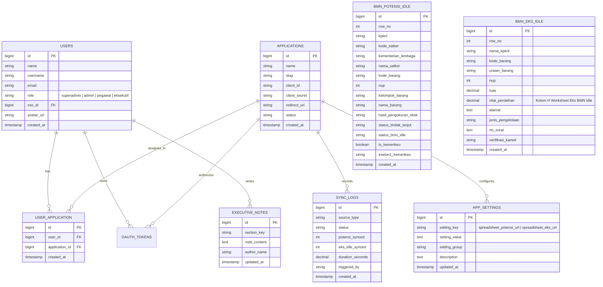
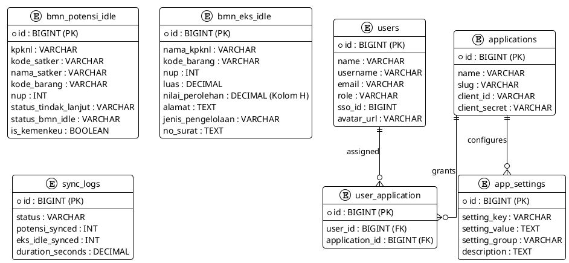
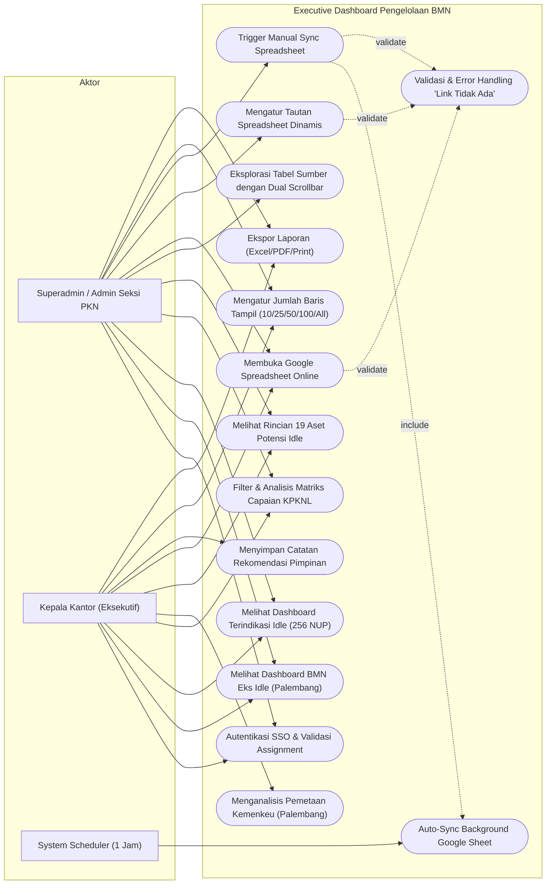
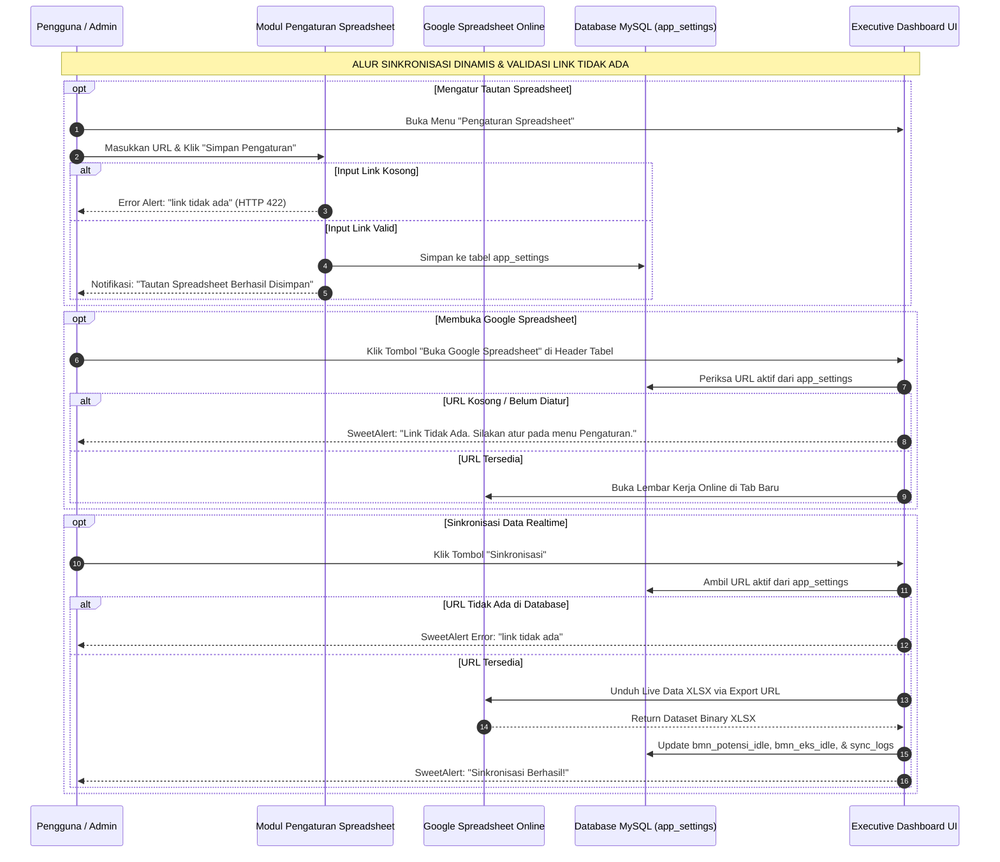

# DOKUMENTASI SISTEM, ANALISIS, DAN DIAGRAM ARSITEKTUR
## Executive Dashboard Pengelolaan BMN Terindikasi Idle dan BMN Eks BMN Idle
**Kantor Pelayanan Kekayaan Negara dan Lelang (KPKNL) Palembang**  
*Kantor Wilayah DJKN Sumatera Selatan, Jambi, dan Bangka Belitung*

---

## DAFTAR ISI
1. [Ringkasan Eksekutif & Jawaban Seluruh Arahan Pengembangan Terbaru](#1-ringkasan-eksekutif--jawaban-seluruh-arahan-pengembangan-terbaru)
2. [Mekanisme Manajemen Tautan Spreadsheet Dinamis & Validasi Sistem](#2-mekanisme-manajemen-tautan-spreadsheet-dinamis--validasi-sistem)
3. [Analisis Mendalam: Aktor, Peran, dan Hak Akses Sistem](#3-analisis-mendalam-aktor-peran-dan-hak-akses-sistem)
4. [Analisis Faktual Metrik & Rekonsiliasi Data Spreadsheet](#4-analisis-faktual-metrik--rekonsiliasi-data-spreadsheet)
5. [Diagram Entity Relationship (ERD)](#5-diagram-entity-relationship-erd)
6. [Diagram Use Case](#6-diagram-use-case)
7. [Diagram Alur Kerja Proses Bisnis (BPMN 2.0)](#7-diagram-alur-kerja-proses-bisnis-bpmn-20)
8. [Petunjuk Penggunaan Sintaks pada Draw.io & PlantUML](#8-petunjuk-penggunaan-sintaks-pada-drawio--plantuml)

---

## 1. RINGKASAN EKSEKUTIF & JAWABAN SELURUH ARAHAN PENGEMBANGAN TERBARU

Berdasarkan lembar instruksi pengembangan pada berkas `rencana pengembangan.txt`, seluruh poin arahan telah selesai disempurnakan:

| No | Poin Arahan | Status | Realisasi & Solusi Teknis |
| :--- | :--- | :---: | :--- |
| **1** | **Sentralisasi Sumber Tautan Spreadsheet ke Menu Pengaturan** | **SELESAI** | Seluruh proses sinkronisasi background, tombol manual sync, serta tombol *"Buka Google Spreadsheet"* di seluruh menu tabel kini **100% mengacu secara dinamis** pada tautan yang disimpan di menu **Pengaturan Spreadsheet** (`app_settings`). Sistem tidak lagi mengandalkan hardcode URL. |
| **2** | **Validasi Ketat Tautan: Menampilkan Error `"link tidak ada"`** | **SELESAI** | Jika tautan spreadsheet kosong, belum diatur, atau dihapus pada menu pengaturan, sistem secara otomatis menolak eksekusi dan memunculkan notifikasi error eksplisit **`"link tidak ada"`** baik saat sinkronisasi API, tombol buka spreadsheet, maupun form submit. |
| **3** | **Pelebaran Kolom Tabel Sumber BMN Eks BMN Idle** | **SELESAI** | Kolom-kolom pada Tabel Sumber BMN Eks BMN Idle diperlebar secara proporsional. Kolom **Alamat Lengkap** (`min-width: 380px`, maks 550px) dan **Nomor Surat / Naskah** (`min-width: 320px`, maks 480px) dengan *word-break wrapping* rapi dan dual scrollbar horizontal. |
| **4** | **Pelebaran Kolom Tabel Sumber Potensi Idle** | **SELESAI** | Kolom **Nama Satker** (`min-width: 250px`), **Surat Klarifikasi** (`min-width: 280px`), dan **Nama Barang** (`min-width: 220px`) diperlebar agar teks panjang dapat dibaca secara leluasa tanpa terpotong. |
| **5** | **Penghapusan Fitur Simulasi Pengguna** | **SELESAI** | Menghapus seluruh tombol simulasi peran pada halaman login (`login.blade.php`), menghapus rute simulasi di `routes/web.php`, dan membersihkan dropdown simulasi di navbar topbar. Akses login murni melalui **SSO KPKNL Palembang**. |
| **6** | **Card Langkah Tindak Lanjut Terbagi Sub-Section** | **SELESAI** | Card ke-4 pada Tab Potensi Kemenkeu disusun menjadi 3 sub-section: **Pemantauan (14 NUP, batas: Akhir Semester I 2027)**, **Penelitian (3 NUP)**, dan **Penelusuran (2 NUP)**. |
| **7** | **Opsi Pilihan Jumlah Baris pada Setiap Tabel DataTables** | **SELESAI** | Seluruh tabel (`#tablePotensi19`, `#tableSourcePotensi`, `#tableSourceEks`, `#tableSyncLog`) kini memiliki kontrol dropdown: **`Tampilkan [10 | 25 | 50 | 100 | Semua] baris per halaman`**. |

---

## 2. MEKANISME MANAJEMEN TAUTAN SPREADSHEET DINAMIS & VALIDASI SISTEM

```
+-------------------------------------------------------------------------------------------------------------------------+
|                                    ARSITEKTUR SENTRALISASI & VALIDASI SPREADSHEET                                       |
+-------------------------------------------------------------------------------------------------------------------------+

 [ Menu Pengaturan Spreadsheet (Tab 9) ]
                   │
                   ▼ (POST /api/settings/spreadsheet)
       [ Validasi: Cek Tautan Ada/Tidak ] ──(Jika Kosong)──► Response: "link tidak ada" (HTTP 422)
                   │ (Jika Valid)
                   ▼
       [ Tabel Database: app_settings ]
         - spreadsheet_potensi_url
         - spreadsheet_eks_url
                   │
        ┌──────────┴──────────────────────────┐
        ▼                                     ▼
 [ GoogleSheetSyncService ]            [ Blade View Dashboard ]
  • Baca dari AppSetting                • Tombol "Buka Google Spreadsheet" (Tab 6 & 7)
  • Jika null: Lempar Exception:         • Jika kosong: SweetAlert ("Link Tidak Ada")
    "link tidak ada"                     • Jika ada: window.open(url, '_blank')
  • Konversi otomatis ke Export URL
  • Download live data & update DB
```

---

## 3. ANALISIS MENDALAM: AKTOR, PERAN, DAN HAK AKSES SISTEM

Sistem dirancang dengan pembagian peran yang terintegrasi langsung dengan database SSO KPKNL Palembang (`sso_kpknl_palembang`):

```
+-------------------------------------------------------------------------------------------------------------------------+
|                                              MATRIKS AKTOR & HAK AKSES SISTEM                                           |
+-------------------+-------------------------------------------------------------------+---------------------------------+
| Aktor             | Peran & Tanggung Jawab Utama                                      | Hak Akses Dashboard             |
+-------------------+-------------------------------------------------------------------+---------------------------------+
| Superadmin SSO    | Mengelola akun pengguna, penugasan aplikasi (assignment check),   | Hak Akses Penuh (All Tabs,      |
|                   | dan konfigurasi tautan Google Spreadsheet.                        | Pengaturan, Manual Sync, Export)|
| Admin Seksi PKN   | Monitoring harian BMN terindikasi idle & eks idle Palembang,      | Tab 1 s.d. Tab 8, Manual Sync,  |
|                   | menindaklanjuti klarifikasi satker, dan ekspor data.              | Ekspor DataTables Excel/PDF     |
| Pimpinan          | Mengambil keputusan strategis, meninjau capaian matriks se-SJB,   | Tab Eksekutif, Matriks Capaian, |
| (Kepala Kantor)   | dan memberikan catatan/arahan pada modul Catatan Eksekutif.       | Simpan Catatan Rekomendasi      |
| Pegawai / Satker  | Meninjau data terfilter satker dan membaca tindak lanjut BMN.     | Read-Only Data Dashboard        |
| System Scheduler  | Menjalankan sinkronisasi background otomatis secara berkala.     | Background Job Runner (Hourly)  |
+-------------------+-------------------------------------------------------------------+---------------------------------+
```

---

## 4. ANALISIS FAKTUAL METRIK & REKONSILIASI DATA SPREADSHEET

1. **Populasi BMN Terindikasi Idle (Palembang 256 NUP)**:
   - **Pemantauan**: 198 NUP (77,3%)
   - **Penelusuran**: 58 NUP (22,7%)
   - **Penelitian**: 0 NUP
   - **Total**: 256 NUP (100% konsisten dengan kartu KPI Populasi Tercatat).

2. **Aset Berpotensi Menjadi BMN Idle Lingkup Kemenkeu (19 NUP)**:
   - **Pemantauan**: **14 NUP** *(Batas waktu tindak lanjut: **Akhir Semester I 2027**)*
   - **Penelitian**: **3 NUP** *(Klarifikasi dokumen kepemilikan & SBSK)*
   - **Penelusuran**: **2 NUP** *(Pengecekan fisik dan pola pemanfaatan satker)*
   - **Nilai Perolehan Buku Aset**: **`Rp154.259.000.000`** (Rp 154,25 Miliar)
   - Rasio terhadap Populasi Kemenkeu: $\frac{19}{79} \times 100\% = \mathbf{24,05\%}$

3. **Nominal Perolehan Aset BMN Eks BMN Idle (Kolom H3:H18)**:
   - Dihitung dari 16 NUP aset eks idle KPKNL Palembang:
     $$\text{Total Nilai Perolehan} = \sum_{i=1}^{16} \text{Kolom } H_i = \mathbf{\text{Rp } 25.254.267.000}$$

---

## 5. DIAGRAM ENTITY RELATIONSHIP (ERD)

### Visual Render Gambar ERD:


### A. Sintaks Mermaid


### B. Sintaks PlantUML


---

## 6. DIAGRAM USE CASE

### Visual Render Gambar Use Case:


### A. Sintaks Mermaid


---

## 7. DIAGRAM ALUR KERJA PROSES BISNIS (BPMN 2.0)

### Visual Render Gambar BPMN:


### A. Sintaks Mermaid


---

## 8. PETUNJUK PENGGUNAAN SINTAKS PADA DRAW.IO & PLANTUML

1. **Menggunakan di Draw.io (Web / Desktop)**:
   - Buka [Draw.io](https://app.diagrams.net/).
   - Klik menu **`Arrange`** -> **`Insert`** -> **`Advanced`** -> Pilih **`PlantUML`** atau **`Mermaid`**.
   - Tempelkan (*paste*) blok kode sintaks PlantUML atau Mermaid yang ada di bab 5, 6, atau 7 di atas.
   - Klik **`Insert`**, diagram akan langsung terkonversi menjadi objek visual interaktif.

2. **Menggunakan di PlantText / PlantUML Server**:
   - Buka [PlantText.com](https://www.planttext.com/) atau server PlantUML lokal.
   - Tempelkan sintaks `@startuml ... @enduml`.
   - Unduh gambar beresolusi tinggi.

---
*Dokumen ini tersimpan permanen di direktori proyek:*  
`d:\laragon\www\Dashboard Pengelolaan BMN\DOKUMENTASI_PENGEMBANGAN_DAN_DIAGRAM.md`
